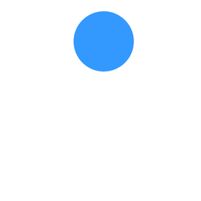
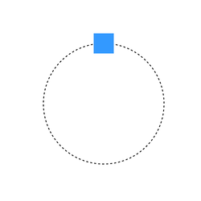
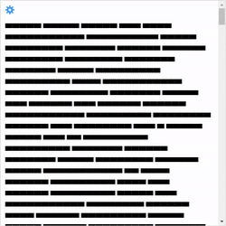
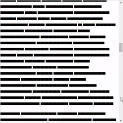

# Examples

## Basic animation

This example shows how to animate an object using keyframes.

[Open example "basic animation" in HTML Animator](https://html-animator.github.io?sceneUrl=%2Fexamples%2Fbasic-animation.svg&scriptUrl=%2Fexamples%2Fbasic-animation.htani)

[Load "basic animation" as HTML](https://rawcdn.githack.com/html-animator/web-app/tree/main/resources/example-basic-animation.html)

## Path animation

This example shows how to animate an object along a path and how HTML Animator automatically splits the path into segments in the exported animation.

[Open example "path animation" in HTML Animator](https://html-animator.github.io?sceneUrl=%2Fexamples%2Fpath-animation.svg&scriptUrl=%2Fexamples%2Fpath-animation.htani)

[Load "path animation" as HTML](https://rawcdn.githack.com/html-animator/web-app/tree/main/resources/example-path-animation.html)

## Stroke animation

This example shows how to animate the drawing progress of a path.

[Open example "stroke animation" in HTML Animator](https://html-animator.github.io?sceneUrl=%2Fexamples%2Fstroke-animation.svg&scriptUrl=%2Fexamples%2Fstroke-animation.htani)

[Load "stroke animation" as HTML](https://rawcdn.githack.com/html-animator/web-app/tree/main/resources/example-stroke-animation.html)

## Loop keyframe group

This example shows how to loop parts of an animation.

[Open example "loop keyframe group" in HTML Animator](https://html-animator.github.io?sceneUrl=%2Fexamples%2Floop-keyframe-group.svg&scriptUrl=%2Fexamples%2Floop-keyframe-group.htani)

[Load "loop keyframe group" as HTML](https://rawcdn.githack.com/html-animator/web-app/tree/main/resources/example-loop-keyframe-group.html)

## Scroll-progress animation

This example shows how to animate an object according to the vertical scroll progress of an HTML page.

[Open example "scroll-progress animation" in HTML Animator](https://html-animator.github.io?sceneUrl=%2Fexamples%2Fscroll-progress-animation.html&scriptUrl=%2Fexamples%2Fscroll-progress-animation.htani)

[Load "scroll-progress animation" as HTML](https://rawcdn.githack.com/html-animator/web-app/tree/main/resources/example-scroll-progress-animation.html)

## View-progress animation

This example shows how to animate an object when it enters and leaves the view when scrolling an HTML page.

[Open example "view-progress animation" in HTML Animator](https://html-animator.github.io?sceneUrl=%2Fexamples%2Fview-progress-animation.html&scriptUrl=%2Fexamples%2Fview-progress-animation.htani)

[Load "view-progress animation" as HTML](https://rawcdn.githack.com/html-animator/web-app/tree/main/resources/example-view-progress-animation.html)
