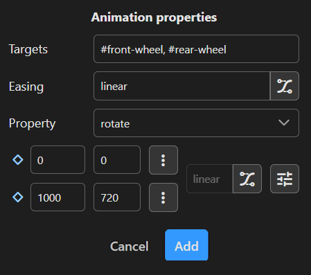

# Getting started

HTML Animator allows the animation of HTML files, HTML files with SVG elements or plain SVG files.

## Prepare scene

If an HTML or SVG file gets well prepared, animating it will be much easier. Prepare your scene files in an HTML or SVG editing app or in a plain text editor.

Preparing includes the following:

### Set IDs

HTML Animator allows to define animation targets flexible via CSS selector strings. But usually it helps to define and reference element IDs.

```
<g id="body-panels"></g>
<g id="windows"></g>
<g id="front-wheel"></g>
<g id="rear-wheel"></g>
```

### Group elements

Group elements hierachially that get animated together. Use div in HTML or g in SVG.

```
<g id="car">
  <g id="body-panels"></g>
  <g id="windows"></g>
  <g id="front-wheel"></g>
  <g id="rear-wheel"></g>
</g>
```

### Define transform origins

If an element's transform property gets animated, depending on the the transform type, the transform origin needs to be set accordingly.

```
<g id="car">
  <g id="body-panels"></g>
  <g id="windows"></g>
  <g id="front-wheel" style="transform-box: fill-box; transform-origin: 50% 50%;"></g>
  <g id="rear-wheel" style="transform-box: fill-box; transform-origin: 50% 50%;"></g>
</g>
```

### Apply transforms

It usually makes animating elements easier when transform properties get applied (i.e. final values get computed and the transform property gets removed afterwards) to the underlying data like path definitions.

## Animate example scene

HTML Animator uses keyframes for animations and the steps below show how to create your first animation.

[Open the getting started scene in HTML Animator](https://html-animator.github.io/?sceneUrl=%2Fexamples%2Fdriving.svg)

### Animate wheels

1. Select **Animation** ➔ **Add keyframe animation**
2. Enter animation targets as CSS selector string **#front-wheel, #rear-wheel**
3. Leave the default easing function **linear** for this animation
4. Select or enter the property **rotate**
5. Enter value 0 for the first keyframe at time 0
6. Enter value 720 for the second keyframe at time 1000
7. Click **Add**
8. Click on  to play the animation



### Animate car bouncing

1. Select **car** in the scene element tree in the left panel
2. Click **Add animation** in the right panel
3. Select type **Keyframe**, select or enter proprty **translateY** and click **Add**
4. Click on  and select the easing function **easeOutBounce**
5. Enter value 0 for the first keyframe at time 0
6. Enter value -2 for the second keyframe and change the time to 50
7. Click on  in the row of the second keyframe and select **Insert keyframe below**
8. Enter value 0 for the third keyframe and change the time to 100
9. These three keyframes are automatically grouped - click  to open the group settings
10. Enter iterations **10** and click **Apply**
11. Click **Add**
12. Click on  to play the animation


### Animate hills and road

1. Select **Animation** ➔ **Add keyframe animation**
2. Enter animation targets as CSS selector string **#hills, #road**
3. Leave the default easing function **linear** for this animation
4. Select or enter the property **translateX**
5. Enter value 0 for the first keyframe at time 0
6. Enter value -1280 for the second keyframe at time 1000
7. Click **Add**
8. Click on  to play the animation
9. Click on / to enable/disable repeating the animation


## Export animation

1. Select **Animation** ➔ **Properties...**
2. Adjust animation properties (e.g. how it gets started or if it should loop)
3. Select **File** ➔ **Export animation...**
4. Set export file type (only applies to SVG scenes)
5. Click **Copy to clipboard** or **Export...** to export your animation as a file

## Animate your own scene

Now you have an idea how HTML Animator works and you can go ahead an animate your own scene.

1. Launch the HTML Animator app
2. Select **File** ➔ **Load scene...** to load your prepared scene

### Animate a property

1. Select **Animation** ➔ **Add keyframe animation**
2. Enter animation targets as CSS selector string
3. Select an easing function
4. Select or enter a property
5. Modify the two default keyframes and add additional keyframes if your animation requires them
6. Click **Add**
7. Click on  to play the animation
