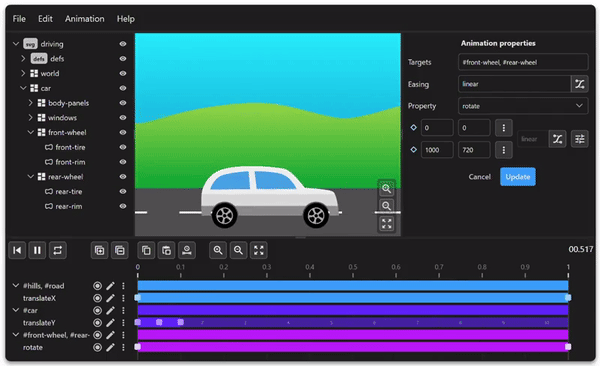

# HTML Animator

HTML Animator is an experimental web application that simplifies the creation of keyframe-based animations based on anime.js.

Anime.js is a great library, but creating complex keyframe animations leads to a lot of code. With a visual editor, it's much easier to create and edit keyframes.

HTML Animator has adopted the concepts of anime.js, which should make it quite easy to use for developers who know anime.js. It uses a custom file format for the animation, but exports JavaScript that only relies on anime.js.

[Launch the app]()

[Gettin started](https://github.com/html-animator/html-animator/wiki/Getting-started)

[Examples](https://github.com/html-animator/html-animator/wiki/Examples)
